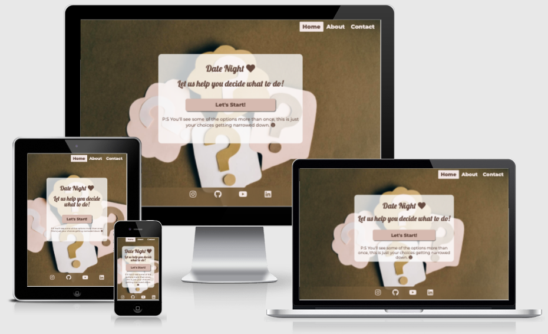
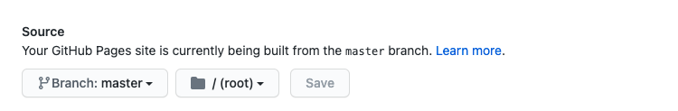
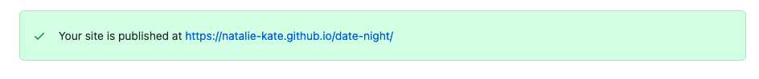
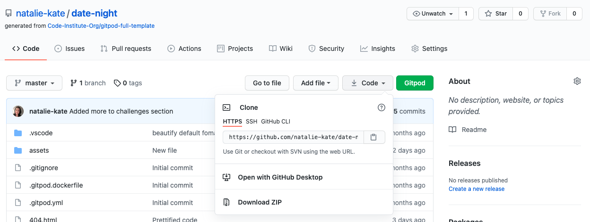

# Decisions decisions 

Here is a link to the live project. (https://natalie-kate.github.io/haunted/)

This website was created for Milestone 2- Interactive Frontend Development project, as part of the Code Institutes diploma in Software development.
I wanted to create a fun quiz that helps indecisive people make a decision. Now when they are asked "What do you want to do tonight?" the answer isn't "I don't know! What do you want to do?" its " Give me a sec and I'll tell you!." The premise is that you subconsciously know what you want to do, so asking a series of questions with only two options each, and a limited time to answer (so you can't overthink it) the options will be narrowed down and leave you with what you actually want.

## Contents 

- [User Experience (UX)](#user-experience-(ux))
   * [Site Goals](#site-goals)
   * [User Stories](#user-stories) 
   * [Structure](#structure)
   * [Design](#design)
   * [Wireframes](#wireframes)

- [Features](#features)
   * [Current Features](#current-features)
   * [Features to implement in the future](#features-to-implement-in-the-future)

- [Technologies](#technologies)
   * [Languages used](#languages-used)
   * [Frameworks, Libraries & Programs Used](#frameworks-,-libraries-&-programs-used)

- [Challenges](#challenges)

- [Testing](#testing)
   * [Automated Testing](#automated-testing)
   * [Testing User Stories](#testing-user-stories)
   * [Manual testing](#manual-testing)
   * [Bugs](#bugs)
      + [Found and Fixed](#found-and-fixed)
      + [Existing](#existing)

- [Deployment](#deployment)

- [Credits](#credits)
   * [Code](#code)
   * [Content](#content)
   * [Media](media)
   * [Acknowledgements](#acknowledgements)

## User Experience (UX)

   ### Strategy 
   - User goals 
     * As a user 
     * As a user 
     * As a user 
     * As a user 

   - Site owner/ business goals
     * 
     * 
     * As the site owner I want my site to be responsive to different screen sizes.
     * As the site owner I want my site to be accessible to my visitors.
     * As the site owner I want to build up a media presence 

   ### User Stories

   - #### First Time Visitor 

        1. As a first time visitor, I want to easily understand the main purpose of the site. 
        2. As a first time visitor, I want to be able to intuitively use the site.
        3. As a first time visitor, I expect to see an attractive, visually appealing site.
        4. As a first time visitor, I expect an accessible site.
        5. As a first time visitor, I expect the site to look good on my mobile device.

   - #### Returning Visitor Goals

        1. 
        2. As a returning visitor, I want to see social media links so that I can follow on my chosen platforms.
        3. 
        4. As a returning visitor, I want to be able to contact the owner with comments or questions.

   - #### Frequent Visitor Goals

        1. 
        2. 
        3. 

   ### Scope

   Within project conception, a list of features were compiled, these were the scored 
   between 1 & 5 for importance and feasbility/ viability which then decided which features 
   could be included for initial launch.    

   ### Structure
-  I decided that it would make sense to have three pages with different sections on the home/about and evidence page. 
    The content took two distinct groups, that of information (Home/about page) and that of evidence. I believe 
    that on a site that is informational that encouraging users to pursue this new interest through
    further resources is important. As it didn't warrant a page to itself, due to its size, I chose to put this after the 
    video evidence as a few of the resources were to the channels that the videos themselves came from, so i thought this would 
    flow nicely. I did however give it its own listing in the navbar due to it being important for users to find and I also think 
    this section will become larger over time and will end up as its own page eventually. 
-  The contact form I chose to put on its own page instead of a modal as I wanted a decently sized text area for people to write in 
    and to have a confirmation modal to pop up on successful submission. In addition this page will have the sign in portal for paid 
    subscribers in the future. 
-   All pages will have a nav menu at the top and a footer at the bottom with the social links as this is what users expect 
    and they will therefore be able to navigate intuitively. On small screens the navigation menu will collapse into the burger 
    icon on the right hand side of the screen with the brand name on the left. 
-   I decided to include a Home and About menu item even though they are the same page as people expect home and about to be 
    listed. If I took away Home people may not be sure how to get back to the beginning from other pages. 

   ### Surface

 -   #### Colour Scheme
        In project inception I looked at possibly a logo for my site on Wix. While I ultimately didn't go with the logo I 
        did find a colour scheme. I wanted to create an atmosphere, not too dark as to create a scary feel, horror is not 
        what we're aiming but not too cheery at the same time. 

        

        The navy/very dark purple and the purple set the tone. The grey is used for the nav and footer providing contrast 
        for the brand name and menu and was picked from the hero image. The very pale green is used to lift and highlight, 
        where as the darker green is used on the badges and for the keyboard focus outline to draw attention. The dark green
        was also used for the hover style of the reference sup element, as the writing is small it was hard to distinguish 
        the colour change from purple to the darker purple used on the other elements.
    
-   #### Typography
    For the headers the font family is Noto Sans KR imported from Google fonts. To complement it I chose Montserrat 
    from the popular pairings section of their website. I chose these as they are easy to read and do not distract 
    from the content itself. In addition they go well with the feel that I want to achieve, others would have not 
    suited the subject matter.
        
-   #### Imagery
    The hero image was chosen for the moodyness the colours and the castle ruins portray. It conveys the sort of place
    that you would imagine to be haunted without being scary and putting people off the site. Similarly the header 
    image in the other two pages has the heavy purple clouds with the spooky ruins drawing you in. 
    The font-awesome ghost "Casper" is again to highlight that this is a light hearted site, not to be taken too seriously.

-   #### Design choices
    I decided to use pictures, text, table and fact boxes in my design. Different ways of presenting information is 
    visually more interesting to a user and makes it easier to pick out sections to look at. As an information site I 
    wanted the content to be there for who is interested but also aware that some people will skip over paragraphs of 
    text so tried to use the design to break up the information into easier to digest sections.
    I chose to make the hero image min-height of 80vh so that there would be a space visible at the bottom of the screen
    indicating to the user to scroll.
    Made the decision to have the CTA button to "share your experiences" within the hidden content on mobiles as two buttons on
    top of one another didn't look nice. Users that have a story to tell will be interested in reading others and so will see it 
    when they press the read more button. 

   ### Skeleton 
Wireframes were created on Balsamiq (see links below)

* [Mobile](assets/readme-assets/wireframes/ms1-mobile.pdf)
* [Tablet](assets/readme-assets/wireframes/ms1-tablet.pdf)
* [Desktop](assets/readme-assets/wireframes/ms1-desktop.pdf)

- On mobile I had a one column design to allow nice spacing and easy to read content

- On tablet I wanted two columns in some sections just to make the layout 
visually more interesting for the user.

- On desktop I wanted to use the rule of 3. Some sections have 3 columns of equal width,
others have 2 columns one of a third and one of two thirds. Again this makes it visually 
interesting, helping distinguish between sections and prevents users becoming 
visually tired.

- Difference from the wireframes to the final site were not many. 

- The About and Introduction paragraphs ended up being on top of one another rather 
 than side by side, this was due to the introduction being longer and creating 
 an empty space which didn't look great.

- Similarly with the media evidence section, originally the pictures and video 
 were to be side by side but the video column had a lot of white space under 
 it due to the pictures taking up more height.

- A picture was also added in to the true stories section for tablet only. This is 
  due to three stories being in one row and the rest in a new row (for hiding on 
  mobile purposes) and so an empty space appeared that needed filled.

- I also added another fact box in the further resources section to fill it out, it 
  looked a bit sparse. 

## Features

### Current features

-   Responsive on all device sizes

-   Accessible 

-   Easy to navigate (Single use learning)

-   Interactive elements 

-   Social Links (build up media presence)

-   Ability to contact owner 

### Features to implement in the future

-   

## Technologies 

### Languages Used

-   [HTML5](https://en.wikipedia.org/wiki/HTML5)
-   [CSS3](https://en.wikipedia.org/wiki/Cascading_Style_Sheets)
-   [Javascript](https://en.wikipedia.org/wiki/JavaScript)

### Frameworks, Libraries & Programs Used

1. [Bootstrap v4.6.0](https://getbootstrap.com/docs/4.6.0/getting-started/introduction/)
    - Bootstrap was used for the initial layout and styling before customising it.
2. [Google Fonts](https://fonts.google.com/)
    - Google fonts were used to import the Noto Sans KR and Montserrat. 
3. [Font Awesome](https://fontawesome.com/)
    - Social media icons in footer and section icons on evidence page.
4. [Git](https://git-scm.com/)
    - Version control.
5. [GitHub](https://github.com/)
    - For storing code and deploying the site.
6. [Gitpod](https://www.gitpod.io/)
    - Used for editing my code.
7. [Balsamiq](https://balsamiq.com/)
    - Wireframe creation
8. [TinyJPG](https://tinyjpg.com/)
    - TinyJPG was used to optimise the images I used on my site to minimise loading time.
9. [Am I responsive](http://ami.responsivedesign.is/)
    - This was used to generate the image at the top of this README.
10. [Codepen](https://codepen.io/your-work)
       - Codepen was used to try out and edit the read more button.
11. [Chrome devtools](https://developer.chrome.com/docs/devtools/)
    - This was used massively throughout development to troubleshoot, try out changes before 
   changing code, to test responsiveness and for testing performance of the final site with lighthouse. 

## Challenges 
   These are aspects of the development that took me a while to figure out due to inexperience with 
   Javascript. 
   -  hi  
        Solution: 
        
   
## Testing

Testing and results can be found [here](TESTING.md)

## Deployment

 - ### Creation 

    I created this repository by: 
    (a) Logging into Github and clicked the green new button. 
    (b) This took me to the page below. I selected the code institute template, input a repository name and clicked the 
    green create repository button. 

    

    (c) Opened new repository and clicked green Gitpod button to create a workspace in Gitpod for editing.

 - ### Github pages
    I deployed my project to Gihub pages by:

    (a) Logged in to Github and opened my [repository](https://github.com/natalie-kate/haunted) 
    (b) From here clicked settings, see picture below.

    

    (c) In settings scrolled down to Github pages, here under source branch I selected Master 
           and kept the default root and then clicked save.

      

    (d) After a minute or two the page has now published and the site address is available in the Github page section.

    

 - ### Forking
   (a) To fork my project sign in to Github and go to my [repository](https://github.com/natalie-kate/haunted) 
   (b) Above and to the right of the settings there are three options and the far right one says Fork, select this. 
   (c) The fork is now in your repositories.

 - ### Clone
   To clone my project sign in to Github and go to my [repository](https://github.com/natalie-kate/haunted) 
   * Clone using command line
     + Next to the green Gitpod button is a button that says code, select this. There is a few options as to how you 
       would like to clone, if you choose https, SSH or Github CLI, select the clipboard icon to copy the URL.
     + In your workspace that you've created, in the terminal , type git clone, paste the URL and enter.

     
   * Desktop Github
     + If you choose to clone by selecting open with desktop Github, it will guide you through the clone with prompts. 

For more information or troubleshooting see the Github documentation 
[here](https://docs.github.com/en/github/creating-cloning-and-archiving-repositories/cloning-a-repository#about-cloning-a-repository)
   
## Credits

### Code

-   [Bootstrap4](https://getbootstrap.com/docs/4.1/getting-started/introduction/): Bootstrap Library used for the layout and styling. 

### Content

-   Content was created by Natalie Alexander.
    
-   README and TESTING took ideas and inspiration for layout and content from these excellent examples:
    

### Media

 - 

### Acknowledgements

-   Code institute. 
-   My mentor Victor Miclovich
-   My mini feb 2021 team on slack for their feedback
