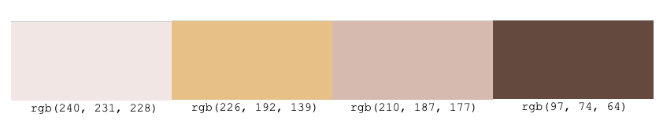

# Date Night 

Here is a link to the live project. (https://natalie-kate.github.io/date-night/)

This website was created for Milestone 2- Interactive Frontend Development project, as part of the Code Institutes diploma in Software development. 
I was inspired by my partners group of friends who were complaining about how indecisive their partners were when it came to making decisions about what to do, where to go etc and so Date Night was born. 
Now when they are asked "What do you want to do tonight?" the answer isn't "I don't know! What do you want to do?" its " Give me a minute and I'll tell you!." 
The premise is that you subconsciously know what you want to do, so asking a series of questions with only two options each, and a limited time to answer (so you can't overthink it) the options will be narrowed down and leave you with what you actually want.

## Contents 

- [User Experience (UX)](#user-experience-(ux))
   * [Strategy](#strategy)
   * [User Stories](#user-stories) 
   * [Scope](#scope)
      + [Current Features](#current-features)
      + [Features to implement in the future](#features-to-implement-in-the-future)
   * [Structure](#structure)
   * [Skeleton](#skeleton)
   * [Surface](#surface)
     + [Colour Scheme](#colour-scheme)
     + [Typography](#typography)
     + [Imagery](#imagery)
- [Technologies](#technologies)
   * [Languages used](#languages-used)
   * [Frameworks, Libraries & Programs Used](#frameworks-,-libraries-&-programs-used)

- [Challenges](#challenges)

- [Testing](#testing)
   
- [Deployment](#deployment)

- [Credits](#credits)
   * [Code](#code)
   * [Content](#content)
   * [Media](media)
   * [Acknowledgements](#acknowledgements)

## User Experience (UX)

   ### Strategy 
   - User goals 
     * As a user I want help deciding what to do for date night.
     * As a user I want to have fun  

   - Site owner/ business goals
     * As the site owner I want my site to be responsive to different screen sizes.
     * As the site owner I want my site to be accessible to my visitors.
     * As the site owner I want to build up a media presence so that future applications will
       have footfall immediately and with that, hopefully gain popularity and therefore could monetise future projects.

   ### User Stories

   - #### First Time Visitor 

        1. As a first time visitor, I want to easily understand the main purpose of the site. 
        2. As a first time visitor, I want to be able to intuitively use the site.
        3. As a first time visitor, I expect to see an attractive, visually appealing site.
        4. As a first time visitor, I expect an accessible site.
        5. As a first time visitor, I expect the site to look good on my mobile device.
        6. As a first time visitor, I want a quick and fun way to choose what to do for date night.

   - #### Returning Visitor Goals

        1. As a returning visitor, if my result is to go out to do something e.g cinema, I want to see where the cinemas are on google maps.
        2. As a returning visitor, if I have a going out result I want to be able to choose what area to search for my resulting place.
        3. As a returning visitor, I want to be able to contact the owner with comments or questions.
        4. As a returning visitor, I want to see social media links so that I can follow on my chosen platforms.

   - #### Frequent Visitor Goals

        1. As a frequent visitor I don't want to be choosing between the same two options each time e.g restaurant vs club. 
        2. As a frequent visitor, I want to be able to contact the owner with suggestions of more options.
        3. As a frequent visitor I want to use links to food delivery services if the result is takeaway.
        4. As a frequent visitor I want to see information about the markers on the map.

   ### Scope

   Within project conception, a list of features were compiled, these were the scored 
   between 1 & 5 for importance and feasibility/ viability which then decided which features 
   could be included for initial launch.    

   #### Current features 

-   Responsive on all device sizes

-   Accessible 

-   Easy to navigate (Single use learning)

-   Interactive elements 

-   Social Links (build up media presence)

-   Ability to contact owner 

-   Timer to ensure user answers the question    instinctively and not overthinking it.

-  Timer changes colour as time goes down and flashes at 0 to warn user they are nearly out of time.

- When timer stops flashing 0, time is up, the user gets the option to start again.

-   If user gets result of getting food delivered there are links to Uber Eats, Deliveroo and Just Eat. Likewise with the other staying in results, there are useful links too.

-   If users initial option is Go out. Then their result will have a google map showing them where the cinema,
    or restaurants or clubs etc are. This can either be via the use my location button or by area of their choice via the input box.

-  On the map, the markers will show name and address of place when clicked and when another is clicked will close the current info and open the new one.

-   On successful submission of contact form there is a personalised confirmation modal and submit button changes to sent.

   #### Features to implement in the future

-   To add in another option on landing page to get help choosing what to eat. In addition when a users result is to order takeaway or go to restaurant then there would also be a link to the What to Eat decision making game. Out with scope of initial launch due to time constraints.
-   If user gets Stay in and try new recipe then have another decision game and depending on that result a recipe api will come back with options to try. Not implementing for initial launch due to time constraints.
-   To add in or remove options in the game depending on whats available in the users area. Would require to have result picture and result paragraph for most things which would be too time consuming for initial launch. Also think it is out of the developers skill level at the moment.

   ### Structure
-  We start with a landing page with a start button, this then takes the user to the beginning of the options and the timer will start. The user goes through the options until only one is left. The result page is opened, displaying the result, with accompanying picture and short paragraph, some will also have accompanying links or map. 
-  The About section is a modal outlining the premise of the game.
-  The contact form I chose to put on its own page instead of a modal as I wanted a decently sized text area for people to write in and to have a confirmation modal to pop up on successful submission. 
-  All pages will have nav links to Home, About and Contact at the top and social links at the bottom as this is what users expect to see. 

  ### Skeleton 

Wireframes were created on Balsamiq (see links below)

* [Mobile](assets/readme-assets/wireframes/ms2-mobile.pdf)
* [Tablet](assets/readme-assets/wireframes/ms2-tablet.pdf)
* [Desktop](assets/readme-assets/wireframes/ms2-desktop.pdf)

 ### Surface

 -   #### Colour Scheme
        
        Found a picture for the background image and used that to pick colours from. 
        As its about finding your date night, I wanted the feel to be soft and romantic so I swapped out the default black for the dark warm brown.
        The darker pink brings the romantic element.
        The other two colours were picked to complement the main two colours, these were used where I needed contrast or to highlight.

        

-   #### Typography
         
      Used [Google Fonts](https://fonts.google.com/) to import the fonts used for this site.
      I picked Lobster for the headings as its a bit more ornate than the usual fonts, bringing a special feel, its not just any night its "Date Night". 
      For the other text I used montserrat as it was among the popular pairings on the google fonts website. Montserrat looked the nicest with Lobster.
      
-   #### Imagery
      
       Picked the background image for its modern and simple design as I didn't want it to be distracting. The overlay muted the colours, so that the writing could still be clearly seen. 
       Used vectors for the result images. They have a fun aspect to them and they are all of similar design so they tie in together which would be harder to get with photos.

    
## Technologies 

### Languages Used

-   [HTML5](https://en.wikipedia.org/wiki/HTML5)
-   [CSS3](https://en.wikipedia.org/wiki/Cascading_Style_Sheets)
-   [JavaScript](https://en.wikipedia.org/wiki/JavaScript)

### Frameworks, Libraries & Programs Used

1. [Bootstrap v4.6.0](https://getbootstrap.com/docs/4.6.0/getting-started/introduction/)
    - Bootstrap was used for the initial layout and styling before customising it.
2. [Google Fonts](https://fonts.google.com/)
    - Google fonts were used to import the Noto Sans KR and Montserrat. 
3. [Font Awesome](https://fontawesome.com/)
    - Social media icons in footer and section icons on evidence page.
4. [Git](https://git-scm.com/)
    - Version control.
5. [GitHub](https://github.com/)
    - For storing code and deploying the site.
6. [Gitpod](https://www.gitpod.io/)
    - Used for editing my code.
7. [Balsamiq](https://balsamiq.com/)
    - Wireframe creation
8. [TinyJPG](https://tinyjpg.com/)
    - TinyJPG was used to optimise the images I used on my site to minimise loading time.
9. [Am I responsive](http://ami.responsivedesign.is/)
    - This was used to generate the image at the top of this README.
10. [Chrome devtools](https://developer.chrome.com/docs/devtools/)
    - This was used massively throughout development to troubleshoot, try out changes before 
   changing code, to test responsiveness and for testing performance of the final site with lighthouse. 
11. [jQuery](https://jquery.com/)
    - JavaScript Library making writing JavaScript quicker and easier.
12. [Code pen](https://codepen.io/)
    - Used to try out snippets of code prior to implementing.
13. [Python tutor](http://pythontutor.com/visualize.html#mode=edit)
    - Used to troubleshoot javascript.
14. [Google maps api](https://developers.google.com/maps)
    - For the map seen in the results for the going out game.
15. [Emailjs](https://www.emailjs.com/)
    - Used to link the contact form to my emails

## Challenges 
   These are aspects of the development that took me a while to figure out due to inexperience.
   -  Had an issue with the submission modal popping up when the form wasn't completed properly and therefore not ready to submit. I had then taken what I thought I needed from code i'd used in MS1 for this issue and it wasn't working. Tried the code i'd used in my MS1 just changing id's to the variables i'd assigned which also didn't work.  
   Solution: Removed the data-toggle and data-target attributes from the submit button, so that the modal wouldn't be triggered. The modal is now only triggered to show by the $('#submit-modal').modal('show'); within the event handler function. Also as you can see I reverted to the id as the variable wasn't working, haven't figured out why yet. My guess is that the modal I assigned to const at the begining then was altered by changing the inner text in the event handler function and so the const i'd assigned didn't exist anymore.
    -  Creating the timer function I attempted to create a for loop that I could see was working/counting down in [Python Tutor](http://pythontutor.com/visualize.html#mode=edit). I then used setTimeout to introduce a 1000ms pause after changing the innertext to the value of my timeLeft variable. This just waited a second before changing time left from 5 in my div to 0. I then changed to setInterval which I came across while researching for answers and removed the for loop and instead added in timeleft -= 1. My timer now continued to count down below zero so I introduced an if statement. This initially didn't work as I had put it out with the setInterval function so my countdown then wasn't working at all. With some rejigging around and making it an if/else statement I got it working.  

   Solution: With the help of stack overflow, w3 and slack got it to work using setInterval, with if/else, -=1 (which seemed so obvious when I seen it) and using return to stop the function if my variables value was < 0.
        
        
   
## Testing

Testing and results can be found [here](TESTING.md)

## Deployment

 - ### Creation 

    I created this repository by: 
    (a) Logging into Github and clicked the green new button. 
    (b) This took me to the page below. I selected the code institute template, input a repository name and clicked the 
    green create repository button. 

    

    (c) Opened new repository and clicked green Gitpod button to create a workspace in Gitpod for editing.

 - ### Github pages
    I deployed my project to Gihub pages by:

    (a) Logged in to Github and opened my [repository](https://github.com/natalie-kate/haunted) 
    (b) From here clicked settings, see picture below.

    

    (c) In settings scrolled down to Github pages, here under source branch I selected Master 
           and kept the default root and then clicked save.

      

    (d) After a minute or two the page has now published and the site address is available in the Github page section.

    

 - ### Forking
   (a) To fork my project sign in to Github and go to my [repository](https://github.com/natalie-kate/haunted) 
   (b) Above and to the right of the settings there are three options and the far right one says Fork, select this. 
   (c) The fork is now in your repositories.

 - ### Clone
   To clone my project sign in to Github and go to my [repository](https://github.com/natalie-kate/haunted) 
   * Clone using command line
     + Next to the green Gitpod button is a button that says code, select this. There is a few options as to how you 
       would like to clone, if you choose https, SSH or Github CLI, select the clipboard icon to copy the URL.
     + In your workspace that you've created, in the terminal , type git clone, paste the URL and enter.

     
   * Desktop Github
     + If you choose to clone by selecting open with desktop Github, it will guide you through the clone with prompts. 

For more information or troubleshooting see the Github documentation 
[here](https://docs.github.com/en/github/creating-cloning-and-archiving-repositories/cloning-a-repository#about-cloning-a-repository)
   
## Credits

### Code

-   [Bootstrap4](https://getbootstrap.com/docs/4.1/getting-started/introduction/): Bootstrap Library used for the layout and styling. 

### Content

-   Content was created by Natalie Alexander.
    
-   README and TESTING took ideas and inspiration for layout and content from these excellent examples:
    

### Media

 - 

### Acknowledgements

-   Code institute. 
-   My mentor Victor Miclovich
-   My mini feb 2021 team on slack for their feedback
