# Testing

## Contents 
   - [Automated Testing](#automated-testing)
      * [HTML validation](#w3c-markup-validator)
      * [CSS validation](#w3c-css-validator)
      * [JS validation](#jshint-javaScript-validator)
      * [Lighthouse testing](#lighthouse-in-devtools)
   - [Testing User Stories](#testing-user-stories)
   - [Manual testing](#manual-testing)
   - [Bugs](#bugs)
      * [Found and Fixed](#found-and-fixed)
      * [Existing](#existing)

## Automated Testing

The W3C Markup Validator and W3C CSS Validator were used to validate every page of the project to ensure there were no 
syntax errors in the project.

-   ## [W3C Markup Validator](https://jigsaw.w3.org/css-validator/#validate_by_input) 

    ### Initial testing
    - index.html

    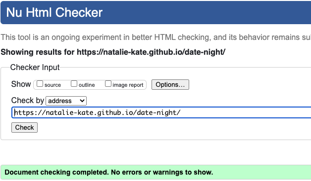

    - decision.html

    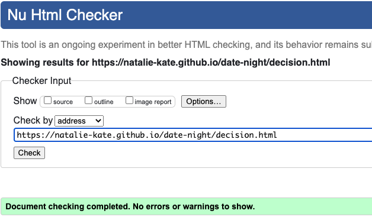

    - contact.html

     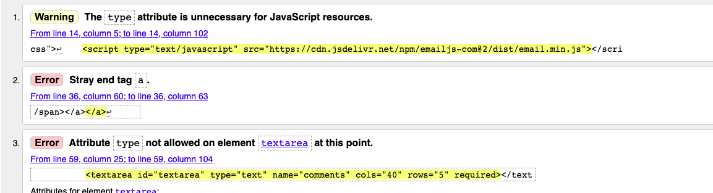

     Removed type attributes from scripts on all my pages which prevented me getting html errors on them as this was the first page I validated. 
     Removed type attribute from text-box and the extra anchor closing tag that was present.

     

     The role and aria-checked I had put on all my labels for the star ratings as I have hidden the actual checkboxes and styled the labels to be the stars so I tried to use accessible attributes on the labels which caused the error. Removed them.
  
    - 404.html

     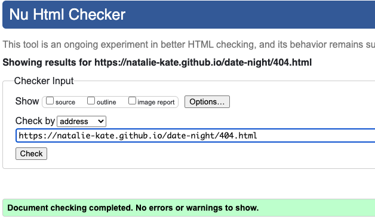
    
    ### Final testing (for those that needed fixed)

    Fortuitously I only had the contact.html to fix so below is the final validation for it.
    
    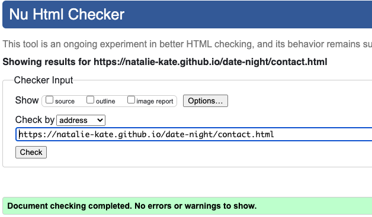

-   ## [W3C CSS Validator](https://jigsaw.w3.org/css-validator/#validate_by_input) 
    
    ### Initial/final testing

    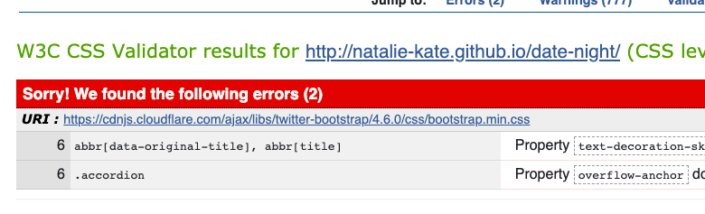
   
    The only errors were for bootstrap. There was a warning for my CSS which was that my button background color and border were the same colour. But as I wanted that border on the hover effect I kept it as is. When I tried to fix the warning by removing the border from the button and add it into the hover effect the button size naturally changed size which I didn't like the look of.
   

-   ## [JSHint JavaScript Validator](https://jshint.com/) 
    
    ### Initial testing
  
    - contact.js

    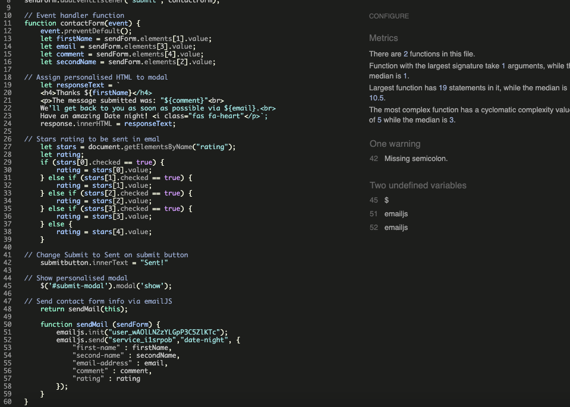

    Added in the missing semi-colon. The undefined variables I left as one was $ for jquery and the other is emailjs so neither need defined.

    - decision.js

     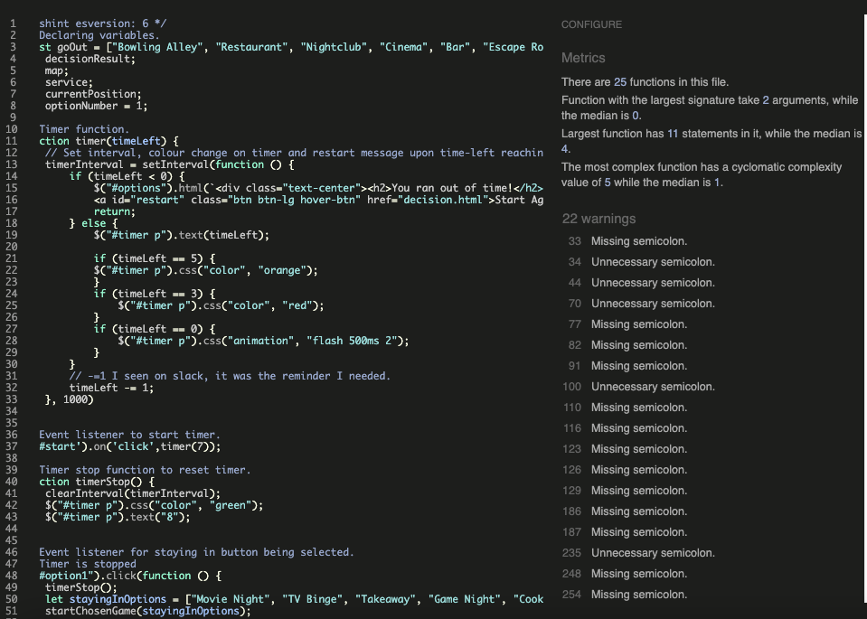
     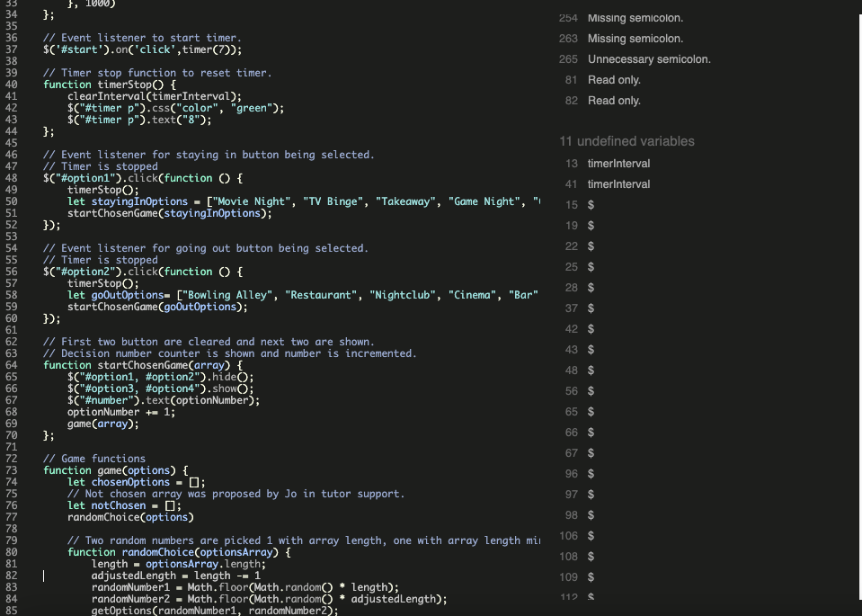
     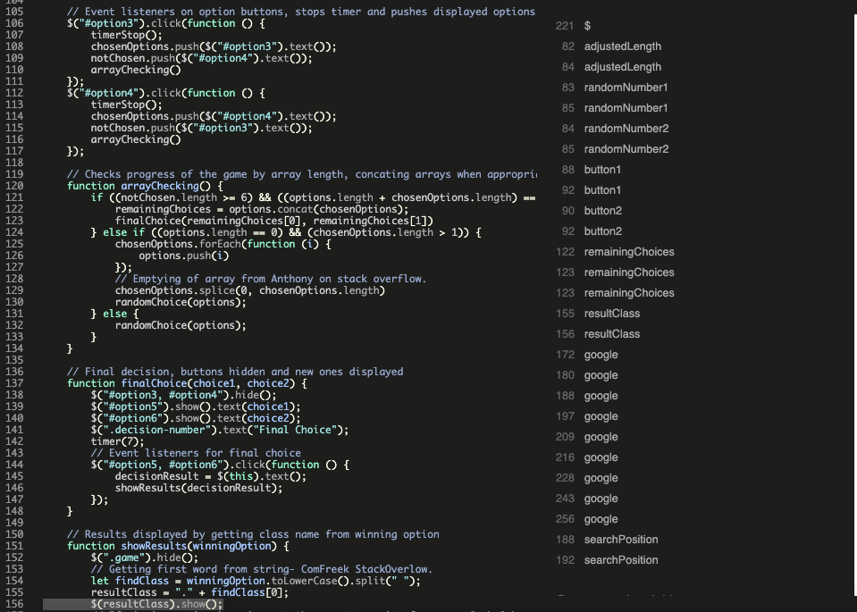

     Fixed all the semi-colons. I had two read only warnings. This was due to me using length as a variable name so I renamed it which did the trick. Again $ for jquery was being flagged aswell as google (for google maps) for being undefined so I added in /*globals $:false */ and /*globals google:false */ to stop them being flagged.
     The other undefined variables I went though and declared them all.
     It was flagging initMap as unused. This is due to its not called in my JS file but by the google maps API when a going out result creates the script for it. So its been left as is.

    ### Final testing

    - contact.js

     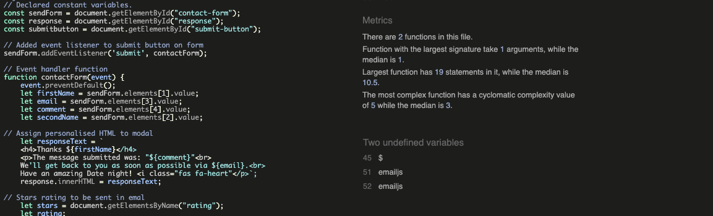

    - decision.js

     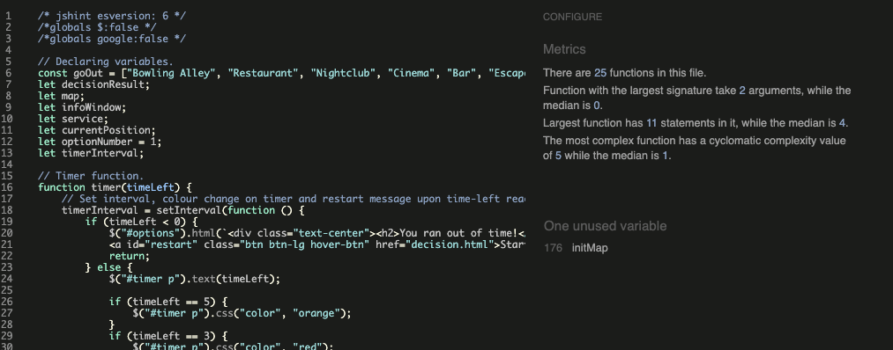

-   ## [Lighthouse](https://chrome.google.com/webstore/detail/lighthouse/blipmdconlkpinefehnmjammfjpmpbjk?hl=en) in devtools
    
    ### Initial scores 

    #### Landing page

    + Initial mobile

    

    + Initial desktop

    #### Game page

    + Initial desktop

    

    + Initial mobile

    

    #### Contact Page

    + Initial desktop

    

    + Initial mobile

    

    ### Actions taken

   

    ### Final test 

    #### Landing page

    + Final Desktop (see report [here]())

    

    + Final mobile (see report [here]())

    

    #### Game page

    + Final desktop (see report [here]())

    

    + Final mobile (see report [here]())

    

    #### Contact Page

    + Final Desktop (see report [here]())

    

    + Final Mobile (see report [here]())

    

## Testing User Stories 

- ### First Time Visitor 

 

- ### Returning Visitor Goals

- ### Frequent Visitor Goals

## Manual Testing

-  
  
## Bugs

   ### Found and Fixed 

  

   ### Existing

   - 