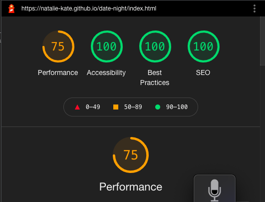

# Testing

## Contents 
   - [Automated Testing](#automated-testing)
      * [HTML validation](#w3c-markup-validator)
      * [CSS validation](#w3c-css-validator)
      * [JS validation](#jshint-javaScript-validator)
      * [Lighthouse testing](#lighthouse-in-devtools)
   - [Testing User Stories](#testing-user-stories)
   - [Manual testing](#manual-testing)
   - [Bugs](#bugs)
      * [Found and Fixed](#found-and-fixed)
      * [Existing](#existing)

## Automated Testing

The W3C Markup Validator and W3C CSS Validator were used to validate every page of the project to ensure there were no 
syntax errors in the project.

-   ## [W3C Markup Validator](https://jigsaw.w3.org/css-validator/#validate_by_input) 

    ### Initial testing
    - index.html

    

    - decision.html

    

    - contact.html

     

     Removed type attributes from scripts on all my pages which prevented me getting html errors on them as this was the first page I validated. 
     Removed type attribute from text-box and the extra anchor closing tag that was present.

     

     The role and aria-checked I had put on all my labels for the star ratings as I have hidden the actual checkboxes and styled the labels to be the stars so I tried to use accessible attributes on the labels which caused the error. Removed them.
  
    - 404.html

     
    
    ### Final testing (for those that needed fixed)

    Fortuitously I only had the contact.html to fix so below is the final validation for it.
    
    

-   ## [W3C CSS Validator](https://jigsaw.w3.org/css-validator/#validate_by_input) 
    
    ### Initial/final testing

    
   
    The only errors were for bootstrap. There was a warning for my CSS which was that my button background color and border were the same colour. But as I wanted that border on the hover effect I kept it as is. When I tried to fix the warning by removing the border from the button and add it into the hover effect the button size naturally changed size which I didn't like the look of.
   

-   ## [JSHint JavaScript Validator](https://jshint.com/) 
    
    ### Initial testing
  
    - contact.js

    

    Added in the missing semi-colon. The undefined variables I left as one was $ for jquery and the other is emailjs so neither need defined.

    - decision.js

     
     
     

     Fixed all the semi-colons. I had two read only warnings. This was due to me using length as a variable name so I renamed it which did the trick. Again $ for jquery was being flagged aswell as google (for google maps) for being undefined so I added in /*globals $:false */ and /*globals google:false */ to stop them being flagged.
     The other undefined variables I went though and declared them all.
     It was flagging initMap as unused, this is due to it not being called in my JS file. It is called however by the google maps API when a going out result creates the script for it. So it has been left as is.

    ### Final testing

    - contact.js

     

    - decision.js

     

-   ## [Lighthouse](https://chrome.google.com/webstore/detail/lighthouse/blipmdconlkpinefehnmjammfjpmpbjk?hl=en) in devtools
    
    ### Initial scores 

    #### Landing page

    + Initial mobile

    

    #### Game page

    + Initial mobile

    

    #### Contact Page

    - Initial mobile
      + No issues to work on.

    #### 404 page

    - Initial mobile
      + Scores were all fine, best practices wasn't 100% though so added in meta description.

    ### Actions taken from initial test.

    - One of the image file paths was wrong affecting best practice scores. Amended.
    - The contrast between the brown writing and pink background of the buttons wasn't passing and so increased font-weight of all the buttons.
    - The result images were causing performance score to be low. As only one image is required for the result, added lazy loading to them.
    - Script loading was also impacting the lighthouse scores so added defer to them.

    ### Final test 

    #### Landing page

    + Final mobile (see report [here](assets/readme-assets/lighthouse-testing/mobile-landing-report.pdf))

    

    + Final Desktop (see report [here](assets/readme-assets/lighthouse-testing/desktop-index-report.pdf))

    

    #### Game page

    + Final mobile (see report [here](assets/readme-assets/lighthouse-testing/mobile-decision-report.pdf))

    

    + Final desktop (see report [here](assets/readme-assets/lighthouse-testing/desktop-decision-report.pdf))

    

    #### Contact Page

    + Final Mobile (see report [here](assets/readme-assets/lighthouse-testing/mobile-contact-report.pdf)))

    

    + Final Desktop (see report [here](assets/readme-assets/lighthouse-testing/desktop-contact-report.pdf)))

    

    #### 404 Page

    + Final Mobile (see report [here](assets/readme-assets/lighthouse-testing/mobile-404-report.pdf)))

    

    + Final Desktop (see report [here](assets/readme-assets/lighthouse-testing/desktop-404-report.pdf)))

    

## Testing User Stories 

- ### First Time Visitor 

 

- ### Returning Visitor Goals

- ### Frequent Visitor Goals

## Manual Testing

-  The website was viewed with browsers: Google chrome, Safari, Microsoft Edge, Firefox, Opera and Internet Explorer. Viewed all pages on each and checked the following:
	◦	Nav links work from all three pages to all links.
	◦	Clicking on social links from all pages work, opening in a new tab
	◦	Clicking the start button loads the decisions.html and starts the timer.
	◦	When the time runs out the start again button reloads decisions.html and timer starts.
	◦	Timer colour change and pulse effect at 0 works
	◦	For each result, correct information is shown.
	◦	All resource links open the correct page in a new tab.
	◦	For going out results, map shows instead of resources links
	◦	Map shows pins of results when location is either input in the search box or use my location button is used.
	◦	If geolocation not supported or blocked by users, alert box shows.
       + Alert box appearing below the map and so on mobile screens this wasn't obvious to the user and so moved it to pop up between the input box and map.
	◦	When pin is clicked open info window with Name of place and address.
       + When clicking on a second marker the original info window didn't close. It had done previously, realised when I was tidying up my code I had declared the infoWindow variable in the function where previously I had declared it at the top of my JS and so I changed it back.
	◦	The pictures that required an attribute had links that opened in a new tab to the correct places.
	◦	Hover effects work on social icons and all links and buttons.
       +  I had given one of my buttons a btn-hover instead of hover-btn class so fixed that. Had also not given the modal button the hover-btn class in contact.html so added that in too.
	◦	Form will not submit without all three required personal details being completed and comment box. Can type in text area, On successful form submission, personalised modal appears and can be closed by both close buttons, star rating works.
       Realised that the star ratings were being skipped over by keyboard control and screen reader and so added in a tab-index
	◦	Upon successful submission, receive an email with details taken from the form by email.js and send button has changed to sent.
       I was getting a 412 error, when I went to my JS account it said I needed to reconnect my google account which as far as I coud tell hadn't disconnected, created a new service which fixed the issue.
	◦	404.html back to home button works.
	◦	404 report issue link takes user to contact form.
	◦	About modal close buttons work.
       
-	 Chrome devtools used to test responsiveness throughout the development process see bugs found below. Viewed all pages on all of the available devices at the end of the project to ensure everything still looked good.
-  	Viewed physically on Macbook air 13", Huawei tablet, HP Chrome book, Dell 21" HD screen, iphone 11, Dell 17" laptop and Pixel 4XL phone to ensure that after all issues found and resolved that there was nothing else appearing

  
## Bugs

   ### Found and Fixed 

  

   ### Existing

   -  Colours not supported on internet explorer so everything is pretty much white. Looked into fixes for this but the slack community advised against it due Internet explorer no longer being supported.